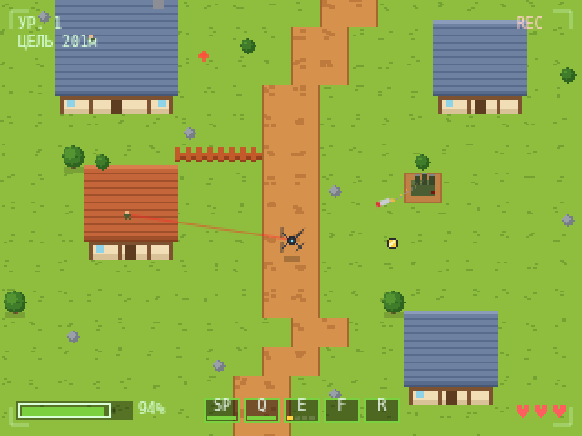
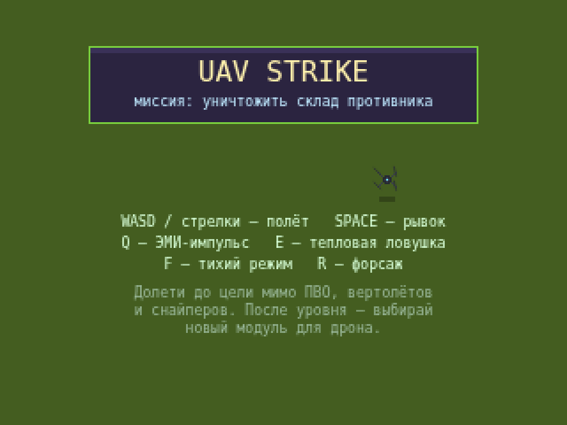
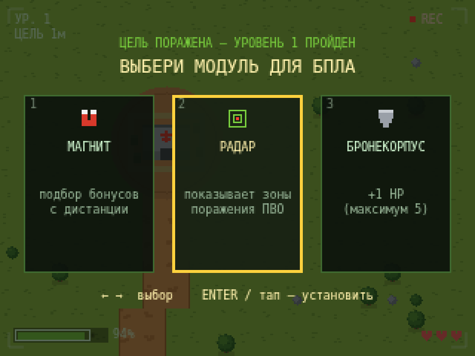
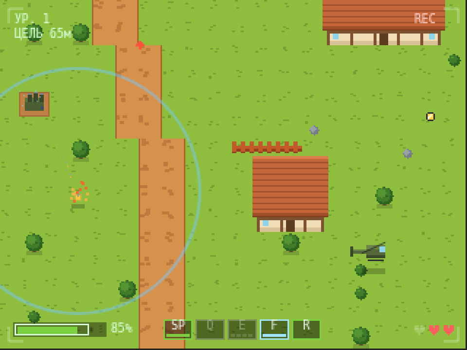
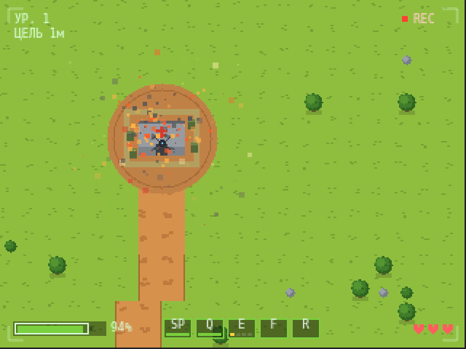

<div align="center">

# 🛸 UAV Strike

**2D pixel-art игра про ударный дрон • чистый HTML5 Canvas • один файл • без зависимостей**

*A 2D pixel-art FPV-drone game. Pure HTML5 Canvas, single file, zero dependencies.*

[▶️ Играть онлайн](https://tendoriel.github.io/uav-strike/) <!-- работает после включения GitHub Pages -->



</div>

---

## 🎯 Об игре

Ты — оператор FPV-дрона. Задача: провести дрон через процедурно генерируемую
деревню и подорвать склад противника. На пути — системы ПВО с самонаводящимися
ракетами, патрульные вертолёты и снайперы на крышах.

| Меню | Выбор модуля после уровня |
|---|---|
|  |  |

| ЭМИ-импульс и тихий режим | Подрыв цели |
|---|---|
|  |  |

## ✨ Особенности

- 🗺️ **Процедурная генерация** — каждый уровень новая карта: дома, тропинки, заборы, деревья
- 🚀 **Три типа угроз** — ПВО с предупреждением «ЗАХВАТ!», вертолёты с очередями, снайперы с лазерным прицелом
- 🃏 **Rogue-lite прокачка** — после каждого уровня выбор одного из 3 случайных модулей: усиленная батарея, быстрый рывок, тепловые ловушки, радар, бронекорпус, магнит и другие
- ⚡ **Активные способности** — ЭМИ-импульс глушит ПВО, тепловая ловушка уводит ракету, тихий режим прячет от радаров, форсаж даёт скорость ценой заряда
- 📈 **Растущая сложность** — длиннее карты, больше врагов, быстрее и манёвреннее ракеты
- 🔋 **Батарея как таймер** — подбирай зарядки и аптечки по пути
- 🎥 FPV-интерфейс с рамкой камеры, REC и помехами при потере сигнала
- 🔊 Звук на WebAudio, 🖐️ поддержка тачскрина, 💾 рекорд в localStorage

## 🕹️ Управление

| Клавиша | Действие |
|---|---|
| `WASD` / стрелки | полёт |
| `Shift` / `Space` | рывок (уклонение) |
| `Q` | ЭМИ-импульс — отключает ПВО и наведение ракет рядом |
| `E` | тепловая ловушка — уводит ракету на себя (заряды ограничены) |
| `F` | тихий режим — меньше радиус обнаружения, быстрее тратит батарею |
| `R` (удерживать) | форсаж — быстрее полёт, дороже по заряду |
| `Enter` | старт / установить модуль |
| касание экрана | полёт к точке, кнопки способностей внизу (мобильные) |

## 🚀 Запуск

Никакой сборки не нужно — просто открой `index.html` в браузере:

```bash
# вариант 1: двойной клик по index.html
# вариант 2: локальный сервер
npx http-server
```

## 🛠️ Технологии

Vanilla JavaScript + HTML5 Canvas. Весь пиксель-арт рисуется кодом —
ни одного внешнего ассета. WebAudio API для звука.
